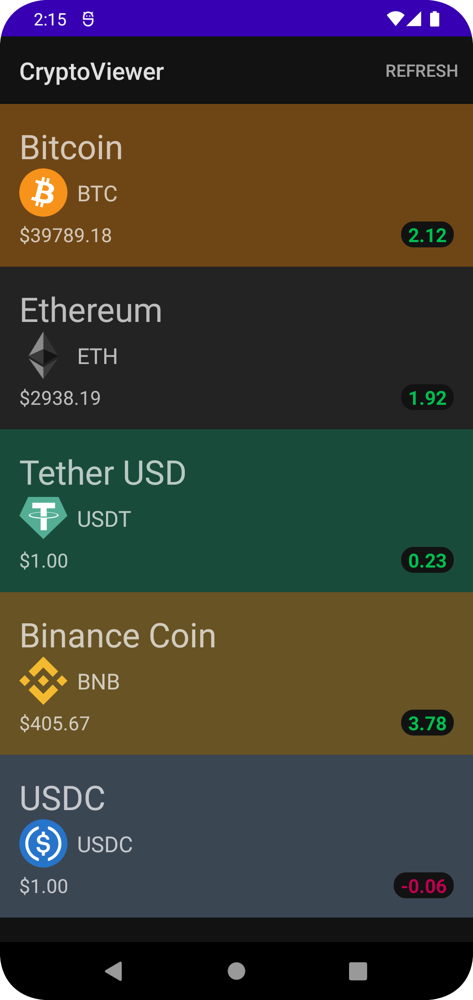

# Welcome to my Cryptocurrency app

Ever wanted to keep tabs on the top cryptocurrencies in real time? This app, powered by
the [Coinranking API](https://developers.coinranking.com/api), fetches and displays details about
the top 5 highest market value Cryptocurrencies.

Written purely for the purpose of demonstrating my coding style, I have written this simple app to
give examples of clean architecture, use of MVVM and use of technologies including:

- Dagger
- Flow
- Coroutines
- Room
- Retrofit
- Gson
- Coil
- Unit testing with Junit and MockK

## Getting started

In order to run this project, the only set up step required is
to [create a Coinranking account and acquire an API key](https://developers.coinranking.com/create-account)
and set it in an `apikey.properties` file at the root of the project and
declare `cryptoApiKey=<your-api-key-here>` (an example file is included).

Then simply build, install and have fun.

Thank you!
